```mermaid{scale: 0.9}
graph TB
    subgraph host["Host App (Rspack)"]
        Router["Router & Shell"]:::host
    end
    
    subgraph explore["Explore MF (Rspack)"]
        ExploreApp["Product Discovery<br>localhost:3004"]:::explore
    end
    
    subgraph decide["Decide MF (Vite)"]
        DecideApp["Product Details<br>localhost:5175"]:::decide
    end
    
    subgraph checkout["Checkout MF (Rspack)"]
        CheckoutApp["Cart & Orders<br>localhost:3003"]:::checkout
    end
    
    Router -.->|"mf:navigate events"| ExploreApp
    Router -.->|"remote loading"| DecideApp
    Router -.->|"cart sync"| CheckoutApp
    
    ExploreApp -.->|"add-to-cart"| CheckoutApp
    DecideApp -.->|"add-to-cart"| CheckoutApp
    CheckoutApp -.->|"updated-cart"| ExploreApp
    
    classDef host fill:#FF6BED,stroke:#AB4B99,stroke-width:2px,color:#000
    classDef explore fill:#344060,stroke:#AB4B99,stroke-width:2px
    classDef decide fill:#8A337B,stroke:#EAEDF3,stroke-width:2px
    classDef checkout fill:#212733,stroke:#FF6BED,stroke-width:2px
```

---
layout: intro
---

# You have 12 weeks and 4 devs.  
## What is the first folder you create?

<!--
Ask for hands. Pause for five seconds. Sample the room. Do not judge the answers.
-->

---
layout: default
---

# The Options

- [ ] `src/components/`  
      Flat inside one app. Files by type.

- [ ] `apps/catalog` + `apps/checkout` + `packages/ui`  
      Microfrontends. Many apps. Shared UI. Independent deploys.

- [ ] `src/module/catalog/`  
      Modular monolith. One app. Folders by feature.


---

# Your first folder predicts your pain.

<VClicks> 

* Your initial choice shapes the entire development experience
* What feels easy today might become your biggest bottleneck
* Structure decisions compound over time

</VClicks>

---


# What you will get in my talk 

<VClicks>

- A rule that maps team size, complexity, and timeline to structure
- A side by side of Flat, Modular, Microfrontends
- A checklist you can paste into your repo

</VClicks>

---
layout: two-cols
heading: About me
---

<template v-slot:default>
<div class="flex flex-col justify-center items-center h-full">
  
  <h2 class="mt-4">Alexander Opalic</h2>
</div>
</template>

<template v-slot:right>
<VClicks class="space-y-2 mt-10 text-xl h-full">

* 💼 Developer at Otto Payments 
* 🇩🇪 Live in Germany
* 🚀 7 years with Vue.js
* 🎤 Speaker & Developer
* 📝 Blogger  
* 🌐 [https://alexop.dev](https://alexop.dev)

</VClicks>
</template>

---
layout: quote
---

# Does your folder tree mirror your org chart?

<QuoteCard author="Mel Conway">
  "Organizations which design systems are constrained to produce designs which are copies of the communication structures of these organizations."
</QuoteCard>

Known as **Conway's Law**.

<!--
Tie their vote to this idea. Now they care about structure choices.
-->

---
layout: center
---

# How to Choose?

<div class="grid grid-cols-3 gap-8 mt-8">
  <div v-click="1" class="text-center">
    <div class="text-6xl mb-4">👤</div>
    <div class="font-bold text-xl mb-2">Team Size</div>
    <div class="opacity-70">Solo → Enterprise</div>
  </div>
  
  <div v-click="2" class="text-center">
    <div class="text-6xl mb-4">🎯</div>
    <div class="font-bold text-xl mb-2">Complexity</div>
    <div class="opacity-70">Simple → Advanced</div>
  </div>
  
  <div v-click="3" class="text-center">
    <div class="text-6xl mb-4">⏱️</div>
    <div class="font-bold text-xl mb-2">Timeline</div>
    <div class="opacity-70">Prototype → Long-term</div>
  </div>
</div>

<!--
Set the axes. These three decide the rest.
-->

---
layout: center
---

# 3 Vue Project Structures

<div class="grid grid-cols-3 gap-8 mt-8">
  <div v-click="1" class="text-center">
    <div class="text-5xl mb-3">📁</div>
    <div class="font-bold text-xl">Flat</div>
  </div>
  
  <div v-click="2" class="text-center">
    <div class="text-5xl mb-3">🏢</div>
    <div class="font-bold text-xl">Micro</div>
  </div>
  
  <div v-click="3" class="text-center">
    <div class="text-5xl mb-3">🧩</div>
    <div class="font-bold text-xl">Modular</div>
  </div>
</div>

---
layout: center
---

<StructureHeadline type="flat" />

---
layout: center
class: 'text-center'
---

Flat structure means grouping files by what they are 
like <span style="color: #FF6BED;">components</span>, <span style="color: #FF6BED;">composables</span>, or <span style="color: #FF6BED;">utils</span> not by the feature they belong to.

---
layout: default
clicks: 8
---

<FolderTree
  root
  title="Flat Structure"
  :structure="`src/
  components/
    BaseButton.vue
    BaseCard.vue
    BaseInput.vue
    TodoList.vue
    TodoListItem.vue
    TheHeader.vue
  composables/
    useTodos.js
    useLocalStorage.js
    useKeyboard.js
  utils/
    validators.ts
    dateHelpers.ts
    todoHelpers.ts
  plugins/
    api.ts
    auth.ts
    toast.ts
    i18n.ts
  layout/
    DefaultLayout.vue
    AdminLayout.vue
  views/
    Home.vue
    TodosPage.vue
    CompletedPage.vue
  router/
    index.ts
  store/
    useTodosStore.ts
  assets/
App.vue
main.js`"
  :open-on-clicks="[
    '/src',
    '/src/components',
    '/src/composables', 
    '/src/utils',
    '/src/plugins',
    '/src/layout',
    '/src/views',
    '/src/router',
    '/src/store',
  ]"
/>

---
layout: two-cols-header
---

# Flat Structure: Trade-offs

::left::

<VClicks>

- ✅ Simple setup (no extra configuration)
- ✅ Fast to start coding
- ✅ Easy to share components
- ✅ Works great for small projects

</VClicks>

::right::

<VClicks>

- ❌ Changes touch many folders
- ❌ Components folder gets huge
- ❌ Hard to find feature-related code
- ❌ Refactoring becomes painful
- ❌ New developers get lost easily
- ❌ Testing becomes unfocused

</VClicks>

---
layout: center
---

<StructureHeadline type="micro" />

---
layout: quote
class: 'text-center'
---

<QuoteCard author="Luca Mezzalira">
  "Microfrontends are the <span v-mark.underline.red="1">technical representation of a business subdomain</span>. They allow <span v-mark.underline.red="2">independent implementations</span> with <span v-mark.underline.red="3">minimal shared code</span> and single team ownership."
</QuoteCard>

---
layout: image
image: '/images/tractorStoreOverview.png'
backgroundSize: contain
---

---
layout: image
image: '/images/tractorDetail.png'
backgroundSize: contain
---

---
layout: center
---

<div class="grid grid-cols-2 gap-6 text-left">

<v-clicks>

<div class="p-6 rounded-lg border border-pink-500/30 bg-slate-800/50">
  <h3 class="text-pink-400 font-bold mb-3">🏗️ Repository</h3>
  <div class="text-white font-semibold">Monorepo with pnpm</div>
</div>

<div class="p-6 rounded-lg border border-pink-500/30 bg-slate-800/50">
  <h3 class="text-pink-400 font-bold mb-3">⚡ Composition</h3>
  <div class="text-white font-semibold">Client-side with Module Federation</div>
</div>

<div class="p-6 rounded-lg border border-pink-500/30 bg-slate-800/50">
  <h3 class="text-pink-400 font-bold mb-3">🚦 Routing</h3>
  <div class="text-white font-semibold">Host owns routing</div>
</div>

<div class="p-6 rounded-lg border border-pink-500/30 bg-slate-800/50">
  <h3 class="text-pink-400 font-bold mb-3">👥 Teams</h3>
  <div class="text-white font-semibold">Explore, Decide, Checkout , Host</div>
</div>

<div class="p-6 rounded-lg border border-pink-500/30 bg-slate-800/50">
  <h3 class="text-pink-400 font-bold mb-3">💬 Communication</h3>
  <div class="text-white font-semibold">Events + localStorage</div>
</div>

<div class="p-6 rounded-lg border border-pink-500/30 bg-slate-800/50">
  <h3 class="text-pink-400 font-bold mb-3">🎨 UI Consistency</h3>
  <div class="text-white font-semibold">Shared component library</div>
</div>

</v-clicks>

</div>

---
layout: center
---



---
layout: default
clicks: 3
---

<FolderTree
  root
  title="Micro Frontends: Tractor Store Structure"
  :structure="`tractor-store-mf/
  apps/
    host/
      src/
        App.vue
        router.ts
        utils/
          remote.ts
        mf.ts
      package.json
    explore/
      src/
        components/
          ProductGrid.vue
          CategoryFilter.vue
        App.vue
        main.ts
        mf.config.ts
      package.json
    decide/
      src/
        components/
          ProductDetail.vue
        App.vue
        main.ts
        vite.config.ts
      package.json
    checkout/
      src/
        components/
          CartSummary.vue
        stores/
          cartStore.ts
        App.vue
        main.ts
      package.json
  packages/
    shared/
      components/
        Button.vue
        Input.vue
      package.json
  pnpm-workspace.yaml`"
  :open-on-clicks="[
    '/tractor-store-mf',
    '/tractor-store-mf/apps',
    '/tractor-store-mf/packages',
    '/tractor-store-mf/packages/shared'
  ]"
/>

---
layout: image
image: '/images/blogMicrofrontends.png'
backgroundSize: contain
---

---
layout: two-cols-header
---

# Micro Frontends: Trade-offs

::left::

<VClicks>

- ✅ Independent deployments (teams deploy when ready)
- ✅ Technology flexibility (mix Vue 2, Vue 3, even React)
- ✅ Team autonomy (own the full stack per domain)
- ✅ Failure isolation (one remote fails, others work)
- ✅ Scalable team structure

</VClicks>

::right::

<VClicks>

- ❌ Runtime complexity (network requests, loading states)
- ❌ Bundle overhead (duplicate dependencies possible)
- ❌ Testing complexity (integration tests across remotes)
- ❌ DevOps burden (multiple deployment pipelines)
- ❌ Higher operational overhead

</VClicks>

---
layout: center
---

<StructureHeadline type="modular" />

---
layout: image
image: '/images/modularMonolith.png'
backgroundSize: contain
---

---
layout: default
---

<div class="grid grid-cols-2 gap-8">
  <div v-click="1">
    <div class="text-xl font-bold mb-4" style="color: rgb(255, 107, 237);">📁 Workspace Structure</div>
    
```yaml
# pnpm-workspace.yaml
packages:
  - 'apps/*'
  - 'packages/*'
```

```
my-app/
├── apps/
│   └── web/           # Main Vue app
└── packages/
    ├── ui/            # Component library
    ├── utils/         # Shared utilities
    └── auth/          # Auth module
```
  </div>

  <div v-click="2">
    <div class="text-xl font-bold mb-4" style="color: rgb(255, 107, 237);">📦 Package Definition</div>
    
```json
// packages/ui/package.json
{
  "name": "@myapp/ui",
  "version": "1.0.0",
  "main": "./dist/index.js",
  "exports": {
    ".": "./src/index.ts",
    "./Button": "./src/Button.vue"
  }
}
```
  </div>
</div>

---
layout: center
---

# pnpm Workspace: Usage

<div class="text-lg opacity-80 mb-8">Import and use packages seamlessly</div>

<div class="max-w-4xl mx-auto">
  <div v-click="1">
    <div class="text-xl font-bold mb-4 text-center" style="color: rgb(255, 107, 237);">🔗 Import Anywhere</div>
    
```vue
<!-- apps/web/src/App.vue -->
<script setup>
import { Button } from '@myapp/ui'
import { formatDate } from '@myapp/utils'
import { useAuth } from '@myapp/auth'

const { login } = useAuth()
</script>

<template>
  <Button @click="login">
    Login {{ formatDate(new Date()) }}
  </Button>
</template>
```
  </div>
</div>

---
layout: default
---

# Modular: With or Without Workspaces

<div class="grid grid-cols-2 gap-8">
  <div v-click="1">
    <div class="text-xl font-bold mb-4" style="color: rgb(255, 107, 237);">📁 Simple Folder-based</div>
    
```
my-app/
├── src/
│   ├── modules/
│   │   ├── explore/
│   │   │   ├── components/
│   │   │   └── composables/
│   │   ├── decide/
│   │   └── checkout/
│   ├── shared/
│   │   └── components/
│   └── App.vue
```

```vue
<!-- Import with relative paths -->
<script setup>
import ProductGrid from '../modules/explore/components/ProductGrid.vue'
import { useCart } from '../modules/checkout/composables/useCart.js'
</script>
```

<div class="text-sm opacity-80 mt-4">
  ✅ Simple setup<br>
  ❌ Long relative paths<br>
  ❌ Hard to refactor
</div>
  </div>

  <div v-click="2">
    <div class="text-xl font-bold mb-4" style="color: rgb(255, 107, 237);">📦 Workspace-based</div>
    
```
my-app/
├── apps/
│   └── main/
├── modules/
│   ├── explore/
│   │   └── package.json
│   ├── decide/
│   └── checkout/
└── pnpm-workspace.yaml
```

```vue
<!-- Import with package names -->
<script setup>
import ProductGrid from '@myapp/explore/components/ProductGrid'
import { useCart } from '@myapp/checkout/composables/useCart'
</script>
```

<div class="text-sm opacity-80 mt-4">
  ✅ Clean imports<br>
  ✅ Independent modules<br>
  ⚠️ More initial setup
</div>
  </div>
</div>

---
layout: default
clicks: 6
---

<FolderTree
  root
  title="Modular: Tractor Store with pnpm Workspace"
  :structure="`tractor-store/
  apps/
    main/
      src/
        App.vue
        main.js
        router/
          index.js
        views/
          HomePage.vue
      package.json
  modules/
    explore/
      components/
        ProductGrid.vue
        CategoryFilter.vue
      composables/
        useProductSearch.js
      store/
        exploreStore.js
      package.json
    decide/
      components/
        ProductDetail.vue
        RecommendationList.vue
      composables/
        useProductDetail.js
      package.json
    checkout/
      components/
        CartSummary.vue
        CheckoutForm.vue
      composables/
        useCart.js
      store/
        cartStore.js
      package.json
  packages/
    shared/
      components/
        Button.vue
        Input.vue
      tokens/
        colors.js
      package.json
  pnpm-workspace.yaml
  package.json`"
  :open-on-clicks="[
    '/tractor-store',
    '/tractor-store/apps',
    '/tractor-store/apps/main',
    '/tractor-store/modules',
    '/tractor-store/modules/explore',
    '/tractor-store/modules/decide', 
    '/tractor-store/modules/checkout',
    '/tractor-store/packages',
    '/tractor-store/packages/shared'
  ]"
/>

---
layout: two-cols-header
---

# Modular Structure: Trade-offs

::left::

<VClicks>

- ✅ Clear feature boundaries
- ✅ Easier to navigate codebase
- ✅ Better code reusability
- ✅ Focused testing per module
- ✅ AI-friendly structure

</VClicks>

::right::

<VClicks>

- ❌ Initial setup complexity
- ❌ More folder nesting
- ❌ Potential for over-engineering
- ❌ Module dependency management
- ❌ Learning curve for teams

</VClicks>

---
layout: intro
---

# Why AI Loves Modular

---
layout: center
---

# AI + Modular Architecture = 💝

<div class="text-lg opacity-80 mb-8">When features are organized together, AI can better understand your intent</div>

<div class="grid grid-cols-2 gap-8 mt-8">
  <div v-click="1" class="p-4 border rounded-lg" style="background-color: rgb(52, 63, 96); border-color: rgb(171, 75, 153);">
    <div class="text-xl font-bold mb-4" style="color: rgb(255, 107, 237);">🎯 Focused Context</div>
    <div class="text-sm opacity-80 space-y-2">
      <div>• All related files in one place</div>
      <div>• AI sees the complete feature scope</div>
      <div>• Better suggestions for feature changes</div>
      <div>• Understands component relationships</div>
    </div>
  </div>
  
  <div v-click="2" class="p-4 border rounded-lg" style="background-color: rgb(52, 63, 96); border-color: rgb(171, 75, 153);">
    <div class="text-xl font-bold mb-4" style="color: rgb(255, 107, 237);">📝 Smart Documentation</div>
    <div class="text-sm opacity-80 space-y-2">
      <div>• Module-specific CLAUDE.md files</div>
      <div>• Copilot instructions per feature</div>
      <div>• Context-aware code generation</div>
      <div>• Domain-specific conventions</div>
    </div>
  </div>
</div>

---
layout: default
clicks: 3
---

<FolderTree
  root
  title="AI-Friendly Checkout Module"
  :structure="`.github/
  copilot-instructions.md
  instructions/
    checkout.instructions.md
modules/checkout/
  components/
    CartSummary.vue
    CartItem.vue
    CheckoutForm.vue
    PaymentSelector.vue
    ShippingForm.vue
    OrderSummary.vue
  composables/
    useCart.js
    useCheckout.js
    usePayment.js
    useShipping.js
  stores/
    cartStore.js
    checkoutStore.js
  types/
    cart.ts
    checkout.ts
    payment.ts
  utils/
    cartHelpers.js
    priceCalculations.js
    validations.js
  __tests__/
    cart.test.js
    checkout.test.js
  CLAUDE.md
  package.json`"
  :open-on-clicks="[
    '/.github',
    '/.github/instructions',
    '/modules/checkout',
    '/modules/checkout/components',
    '/modules/checkout/composables', 
    '/modules/checkout/stores'
  ]"
/>

---
layout: default
---

# Module-Specific AI Instructions

<div class="grid grid-cols-2 gap-6">
  <div v-click="1">
    <div class="text-xl font-bold mb-4" style="color: rgb(255, 107, 237);">📄 CLAUDE.md</div>
    
```markdown
# Tech Stack
- Framework: Vue 3 + Vite
- State: Pinia stores  
- Types: TypeScript
- Testing: Vitest + Testing Library

# Project Structure
- `modules/checkout/`: Shopping cart & orders
- `modules/checkout/stores/`: Cart state management
- `modules/checkout/types/`: TypeScript interfaces

# Commands
- `pnpm test checkout`: Run checkout tests
- `pnpm dev`: Start development server

# Code Style
- All prices in cents (integer)
- Use CartItem interface for cart data
- Validate with Zod before submission
```
  </div>

  <div v-click="2">
    <div class="text-xl font-bold mb-4" style="color: rgb(255, 107, 237);">🤖 VS Code Scoped Instructions</div>
    
```markdown
---
applyTo: "modules/checkout/**/*"
description: "E-commerce checkout rules"
---
# Checkout Module Instructions

## Data Handling
- Store prices as integers (cents)
- Use CartItem interface consistently
- Validate all forms with Zod schemas

## State Management  
- Use Pinia stores for cart state
- Implement optimistic updates
- Handle payment failures gracefully

## Testing
- Test all payment flows
- Mock payment providers
- Verify cart persistence
```
  </div>
</div>

---
layout: center
---

# AI Benefits in Practice

<div class="grid grid-cols-3 gap-6 mt-8">
  <div v-click="1" class="p-4 border rounded-lg text-center" style="background-color: rgb(52, 63, 96); border-color: rgb(171, 75, 153);">
    <div class="text-4xl mb-3">🔍</div>
    <div class="font-bold text-lg mb-2" style="color: rgb(255, 107, 237);">Better Search</div>
    <div class="text-sm opacity-80">"Show me all checkout validation logic" finds everything in one module</div>
  </div>
  
  <div v-click="2" class="p-4 border rounded-lg text-center" style="background-color: rgb(52, 63, 96); border-color: rgb(171, 75, 153);">
    <div class="text-4xl mb-3">⚡</div>
    <div class="font-bold text-lg mb-2" style="color: rgb(255, 107, 237);">Faster Generation</div>
    <div class="text-sm opacity-80">AI sees related components and suggests consistent patterns</div>
  </div>
  
  <div v-click="3" class="p-4 border rounded-lg text-center" style="background-color: rgb(52, 63, 96); border-color: rgb(171, 75, 153);">
    <div class="text-4xl mb-3">🎯</div>
    <div class="font-bold text-lg mb-2" style="color: rgb(255, 107, 237);">Smarter Refactoring</div>
    <div class="text-sm opacity-80">Understands feature boundaries when suggesting changes</div>
  </div>
</div>

<div v-click="4" class="mt-8 p-4 bg-card rounded-lg">
  <div class="text-lg font-bold text-primary mb-2">💡 Pro Tip</div>
  <div class="opacity-80">Add module-specific instructions to help AI understand your domain logic and coding patterns</div>
</div>

---
layout: center
---

# More Modular Benefits

<div class="grid grid-cols-2 gap-8 mt-8">
  <div v-click="1" class="p-4 border rounded-lg" style="background-color: rgb(52, 63, 96); border-color: rgb(171, 75, 153);">
    <div class="text-4xl mb-3">🔄</div>
    <div class="font-bold text-lg mb-2" style="color: rgb(255, 107, 237);">Easy Replacement</div>
    <div class="text-sm opacity-80">Replace entire features without touching other modules. Upgrade payment systems independently from product catalog.</div>
  </div>
  
  <div v-click="2" class="p-4 border rounded-lg" style="background-color: rgb(52, 63, 96); border-color: rgb(171, 75, 153);">
    <div class="text-4xl mb-3">⚡</div>
    <div class="font-bold text-lg mb-2" style="color: rgb(255, 107, 237);">Targeted Testing</div>
    <div class="text-sm opacity-80">Run only tests for changed modules in CI pipeline. TypeScript business logic modules enable focused test execution.</div>
  </div>
</div>

<div class="grid grid-cols-2 gap-8 mt-6">
  <div v-click="3" class="p-4 border rounded-lg" style="background-color: rgb(52, 63, 96); border-color: rgb(171, 75, 153);">
    <div class="text-4xl mb-3">📸</div>
    <div class="font-bold text-lg mb-2" style="color: rgb(255, 107, 237);">Specialized Testing</div>
    <div class="text-sm opacity-80">Add screenshot tests to UI component libraries. Visual regression testing becomes manageable and isolated.</div>
  </div>
  
  <div v-click="4" class="p-4 border rounded-lg" style="background-color: rgb(52, 63, 96); border-color: rgb(171, 75, 153);">
    <div class="text-4xl mb-3">🎯</div>
    <div class="font-bold text-lg mb-2" style="color: rgb(255, 107, 237);">Core Business Logic</div>
    <div class="text-sm opacity-80">Separate TypeScript modules for business rules. Pure functions that are easy to test and reuse across features.</div>
  </div>
</div>

---
layout: center
---

# My Recommendation 🎯


<div class="grid grid-cols-2 gap-8 mt-8">
  <div v-click="1" class="p-6 border-2 rounded-lg" style="background-color: rgb(52, 63, 96); border-color: rgb(255, 107, 237);">
    <div class="text-5xl mb-4">✅</div>
    <div class="font-bold text-2xl mb-4" style="color: rgb(255, 107, 237);">Modular Monolith</div>
    <div class="text-lg opacity-90 mb-4">Default choice for most projects</div>
    <div class="text-sm opacity-80 space-y-1">
      <div>• Works for all team sizes</div>
      <div>• Easier to maintain and refactor</div>
      <div>• Better developer experience</div>
      <div>• AI-friendly structure</div>
      <div>• Faster iteration cycles</div>
    </div>
  </div>
  
  <div v-click="2" class="p-6 border rounded-lg" style="background-color: rgb(52, 63, 96); border-color: rgb(171, 75, 153);">
    <div class="text-5xl mb-4">⚠️</div>
    <div class="font-bold text-2xl mb-4" style="color: rgb(255, 107, 237);">Micro Frontends</div>
    <div class="text-lg opacity-90 mb-4">Only with organizational need</div>
    <div class="text-sm opacity-80 space-y-1">
      <div>• Multiple independent teams</div>
      <div>• Different deployment cycles</div>
      <div>• Technology diversity required</div>
      <div>• Complex domain boundaries</div>
      <div>• High operational maturity</div>
    </div>
  </div>
</div>

<div v-click="3" class="mt-8 p-4 bg-card rounded-lg">
  <div class="text-lg font-bold text-primary mb-2">💡 Start Simple, Evolve When Needed</div>
  <div class="opacity-80">Begin with modular monolith. You can always extract modules into micro frontends later when organizational complexity demands it.</div>
</div>

---
layout: center
---

# Thank You! 🎉


<div class="flex justify-center gap-8 mt-8">
  <ContactItem
    iconClass="i-carbon-user"
    text="alexop.dev"
    color="#60A5FA"
  />
  <ContactItem
    iconClass="i-carbon-logo-github"
    text="alexanderop"
    color="#A78BFA"
  />
  <ContactItem
    iconClass="i-carbon-logo-x"
    text="@alexanderopalic"
    color="#3B82F6"
  />
</div>


