```mermaid{scale: 0.9}
graph TB
    subgraph host["Host App (Rspack)"]
        Router["Router & Shell"]:::host
    end
    
    subgraph explore["Explore MF (Rspack)"]
        ExploreApp["Product Discovery<br>localhost:3004"]:::explore
    end
    
    subgraph decide["Decide MF (Vite)"]
        DecideApp["Product Details<br>localhost:5175"]:::decide
    end
    
    subgraph checkout["Checkout MF (Rspack)"]
        CheckoutApp["Cart & Orders<br>localhost:3003"]:::checkout
    end
    
    Router -.->|"mf:navigate events"| ExploreApp
    Router -.->|"remote loading"| DecideApp
    Router -.->|"cart sync"| CheckoutApp
    
    ExploreApp -.->|"add-to-cart"| CheckoutApp
    DecideApp -.->|"add-to-cart"| CheckoutApp
    CheckoutApp -.->|"updated-cart"| ExploreApp
    
    classDef host fill:#FF6BED,stroke:#AB4B99,stroke-width:2px,color:#000
    classDef explore fill:#344060,stroke:#AB4B99,stroke-width:2px
    classDef decide fill:#8A337B,stroke:#EAEDF3,stroke-width:2px
    classDef checkout fill:#212733,stroke:#FF6BED,stroke-width:2px
```

---
layout: intro
---

# Raise your hand if your  
## `components/` folder has over 100 files

---
layout: image
image: /images/bluepill.png
backgroundSize: contain
---

---

# The initial choice matters 

<div class="grid grid-cols-2 gap-8 mt-8">
  <FeatureCard
    v-click="1"
    icon="🎯"
    title="Development Experience"
    description="Your initial choice shapes the entire development experience"
  />
  
  <FeatureCard
    v-click="2"
    icon="⚠️"
    title="Future Bottlenecks"
    description="What feels easy today might become your biggest bottleneck"
  />
</div>

---


# What you will get in my talk 

<div class="grid grid-cols-2 gap-8 mt-8">
  <FeatureCard
    v-click="1"
    icon="📏"
    title="Decision Framework"
    description="A rule that maps team size, complexity, and timeline to structure"
  />
  
  <FeatureCard
    v-click="2"
    icon="⚖️"
    title="Structure Comparison"
    description="A side by side of Flat, Micro, and Modular"
  />
</div>

---
layout: two-cols
heading: About me
---

<template v-slot:default>
<div class="flex flex-col justify-center items-center h-full">
  
  <h2 class="mt-4">Alexander Opalic</h2>
</div>
</template>

<template v-slot:right>
<VClicks class="space-y-2 mt-10 text-xl h-full">

* 🚀 7 years building with Vue.js
* 💼 Developer at Otto Payments (Hamburg)
* 🏡 Based in Geretsried (south of Munich, Bavaria)
* ✍️ Blogger at alexop.dev
* 🎤 Sharing & speaking about Vue, testing & GraphQL

</VClicks>
</template>

---
layout: center
---

# General Rules & Best Practices

<div class="text-lg opacity-80 mb-8">Apply these naming conventions to any Vue project structure</div>

<div class="grid grid-cols-3 gap-6 mt-8">
  <FeatureCard
    v-click="1"
    icon="🏷️"
    title="Base Component Prefix"
    description="Use 'Base' prefix for UI components: BaseButton.vue, BaseTable.vue, BaseIcon.vue"
  />
  
  <FeatureCard
    v-click="2"
    icon="🔗"
    title="Related Component Grouping"
    description="Group related components: TodoList.vue, TodoListItem.vue, TodoListItemButton.vue"
  />
  
  <FeatureCard
    v-click="3"
    icon="📝"
    title="Hierarchical Naming"
    description="Start with highest-level words: SearchButtonClear.vue, SettingsCheckboxLaunch.vue"
  />
</div>

---
layout: quote
---

# Does your folder tree mirror your org chart?

<QuoteCard author="Mel Conway">
  "Organizations which design systems are constrained to produce designs which are copies of the communication structures of these organizations."
</QuoteCard>

Known as **Conway's Law**.

<!--
Tie their vote to this idea. Now they care about structure choices.
-->

---
layout: center
---

# How to Choose?

<div class="grid grid-cols-3 gap-8 mt-8">
  <div v-click="1" class="text-center">
    <div class="text-6xl mb-4">👤</div>
    <div class="font-bold text-xl mb-2">Team Size</div>
    <div class="opacity-70">Solo → Enterprise</div>
  </div>
  
  <div v-click="2" class="text-center">
    <div class="text-6xl mb-4">🎯</div>
    <div class="font-bold text-xl mb-2">Complexity</div>
    <div class="opacity-70">Simple → Advanced</div>
  </div>
  
  <div v-click="3" class="text-center">
    <div class="text-6xl mb-4">⏱️</div>
    <div class="font-bold text-xl mb-2">Timeline</div>
    <div class="opacity-70">Prototype → Long-term</div>
  </div>
</div>

<!--
Set the axes. These three decide the rest.
-->

---
layout: center
---

# 3 Vue Project Structures

<div class="grid grid-cols-3 gap-8 mt-8">
  <div v-click="1" class="text-center">
    <div class="text-5xl mb-3">📁</div>
    <div class="font-bold text-xl">Flat</div>
  </div>
  
  <div v-click="2" class="text-center">
    <div class="text-5xl mb-3">🏢</div>
    <div class="font-bold text-xl">Micro</div>
  </div>
  
  <div v-click="3" class="text-center">
    <div class="text-5xl mb-3">🧩</div>
    <div class="font-bold text-xl">Modular</div>
  </div>
</div>

---
layout: center
---

<StructureHeadline type="flat" />

---
layout: center
class: 'text-center'
---

Flat structure means grouping files by <span v-mark.underline.red="1">what they are</span> 
like <span v-mark.underline.red="2">components</span>, <span v-mark.underline.red="3">composables</span>, or <span v-mark.underline.red="4">utils</span> not by the feature they belong to.

---
layout: default
clicks: 8
---

<FolderTree
  root
  title="Flat Structure"
  :structure="`src/
  components/
    BaseButton.vue
    BaseCard.vue
    BaseInput.vue
    TodoList.vue
    TodoListItem.vue
    TheHeader.vue
  composables/
    useTodos.ts
    useLocalStorage.ts
    useKeyboard.ts
  utils/
    validators.ts
    dateHelpers.ts
    todoHelpers.ts
  plugins/
    api.ts
    auth.ts
    toast.ts
    i18n.ts
  layout/
    DefaultLayout.vue
    AdminLayout.vue
  views/
    Home.vue
    TodosPage.vue
    CompletedPage.vue
  router/
    index.ts
  store/
    useTodosStore.ts
  assets/
App.vue
main.js`"
  :open-on-clicks="[
    '/src',
    '/src/components',
    '/src/composables', 
    '/src/utils',
    '/src/plugins',
    '/src/layout',
    '/src/views',
    '/src/router',
    '/src/store',
  ]"
/>

---
layout: two-cols-header
---

# Flat Structure: Trade-offs

::left::

<VClicks>

✅ Start fast with no setup

✅ Great for small apps and prototypes

✅ Simple to deploy

</VClicks>

::right::

<VClicks>

❌ Components folder grows too big

❌ You jump across many folders for one feature

❌ New devs struggle to find code

❌ Refactoring takes more effort

❌ Hard to run only the tests for one feature

❌ Team growth makes it worse

</VClicks>

---
layout: center
---

<StructureHeadline type="micro" />

---
layout: intro
---

# Raise your hand if you have  
## worked on a project that used microfrontends

---
layout: quote
class: 'text-center'
---

<QuoteCard author="Luca Mezzalira">
  "Microfrontends are the <span v-mark.underline.red="1">technical representation of a business subdomain</span>. They allow <span v-mark.underline.red="2">independent implementations</span> with <span v-mark.underline.red="3">minimal shared code</span> and single team ownership."
</QuoteCard>

---
layout: image
image: '/images/tractorStoreOverview.png'
backgroundSize: contain
---

---
layout: image
image: '/images/tractorDetail.png'
backgroundSize: contain
---

---
layout: default
---

# 👥 Teams: Clear Boundaries

<div class="grid grid-cols-2 gap-8">
  <div v-click="1">
    <div class="text-xl font-bold mb-4 text-primary">Team Structure</div>
    
```
apps/
├── host/      ← Platform Team
├── explore/   ← Discovery Team  
├── decide/    ← Product Team
└── checkout/  ← Commerce Team
```
  </div>

  <div v-click="2">
    <div class="text-xl font-bold mb-4 text-primary">Team Exports</div>
    
```ts
// explore/mf.config.ts
exposes: {
  './HomePage': './src/HomePage.vue'
}

// decide/vite.config.ts  
exposes: {
  './ProductPage': './src/ProductPage.vue'
}
```
  </div>
</div>

<div v-click="3">
<strong>Each team owns their business subdomain</strong>
</div>

---
layout: default
---

# 🏗️ Repository: Monorepo with pnpm

<div v-click="1">

```yaml
# pnpm-workspace.yaml
packages:
  - 'apps/*'
  - 'packages/*'
```

</div>

<div v-click="2">

```
tractor-store-mf/
├── apps/
│   ├── host/     ← Shell app
│   ├── explore/  ← Discovery
│   ├── decide/   ← Product details
│   └── checkout/ ← Cart
└── packages/
    └── shared/   ← UI library
```

</div>

---
layout: default
---

# ⚡ Composition: Module Federation

<div v-click="1">

```ts
// Host loads remotes at runtime
createInstance({
  name: 'host',
  remotes: [
    { name: 'explore',  entry: 'http://localhost:3004/mf-manifest.json' },
    { name: 'decide',   entry: 'http://localhost:5175/mf-manifest.json' },
    { name: 'checkout', entry: 'http://localhost:3003/mf-manifest.json' },
  ]
})
```

</div>

<div v-click="2">

```ts
window.getComponent = (id: string) => loadRemote(id)
```

</div>

<div v-click="3">
<strong>Load components dynamically with fallbacks</strong>
</div>

---
layout: default
---

# 🚦 Routing: Host Owns All Routes

<div v-click="1">

```ts
// Host router maps URLs to remote components
const router = createRouter({
  routes: [
    { path: '/', component: remote('explore/HomePage') },
    { path: '/product/:id', component: remote('decide/ProductPage') },
    { path: '/checkout/cart', component: remote('checkout/CartPage') },
  ]
})
```

</div>

<div v-click="2">

```ts
// remote() loads with fallbacks
function remote(id: string) {
  return defineAsyncComponent({
    loader: () => window.getComponent(id),
    loadingComponent: Loading,
    errorComponent: ErrorFallback
  })
}
```

</div>

<div v-click="3">
<strong>Single source of truth for navigation</strong>
</div>

---
layout: default
---

# 💬 Communication: Events + localStorage

<div v-click="1">

```ts
// Navigation: any MF can trigger
window.dispatchEvent(new CustomEvent('mf:navigate', { 
  detail: { to: '/checkout/cart' } 
}))

// Host listens and routes
window.addEventListener('mf:navigate', (e) => {
  router.push(e.detail.to)
})
```

</div>

<div v-click="2">

```ts  
// Cart sync: checkout owns state
window.addEventListener('add-to-cart', (e) => {
  // update cart
  localStorage.setItem('cart', JSON.stringify(cart))
  window.dispatchEvent(new CustomEvent('updated-cart'))
})
```

</div>

<div v-click="3">
<strong>No shared store - explicit events only</strong>
</div>

---
layout: default
---

# 🎨 UI Consistency: Shared Library

<div v-click="1">

```vue
<!-- packages/shared/Button.vue -->
<template>
  <button :style="{ backgroundColor: variant === 'primary' ? '#FF6BED' : '#344060' }">
    <slot />
  </button>
</template>
```

</div>

<div v-click="2">

```vue
<!-- All microfrontends import the same Button -->
<script setup>
import { Button } from '@tractor/shared'
</script>
<template>
  <Button variant="primary">Add to Cart</Button>
</template>
```

</div>

<div v-click="3" class="text-2xl font-bold text-center mt-8" style="color: #FF6BED;">
Shared components + tokens = visual cohesion
</div>

---
layout: center
---



---
layout: default
clicks: 3
---

<FolderTree
  root
  title="Micro Frontends: Tractor Store Structure"
  :structure="`tractor-store-mf/
  apps/
    host/
      src/
        App.vue
        router.ts
        utils/
          remote.ts
        mf.ts
      package.json
    explore/
      src/
        components/
          ProductGrid.vue
          CategoryFilter.vue
        App.vue
        main.ts
        mf.config.ts
      package.json
    decide/
      src/
        components/
          ProductDetail.vue
        App.vue
        main.ts
        vite.config.ts
      package.json
    checkout/
      src/
        components/
          CartSummary.vue
        stores/
          cartStore.ts
        App.vue
        main.ts
      package.json
  packages/
    shared/
      components/
        Button.vue
        Input.vue
      package.json
  pnpm-workspace.yaml`"
  :open-on-clicks="[
    '/tractor-store-mf',
    '/tractor-store-mf/apps',
    '/tractor-store-mf/packages',
    '/tractor-store-mf/packages/shared'
  ]"
/>

---
layout: image
image: '/images/blogMicrofrontends.png'
backgroundSize: contain
---

---
layout: two-cols-header
---

# Micro Frontends: Trade-offs

::left::

<VClicks>

✅ Each team owns its part

✅ Teams can use different tech stacks

✅ One part can fail without breaking the rest

✅ Works well for very large orgs

</VClicks>

::right::

<VClicks>

❌ Setup is complex

❌ Bundles often duplicate code

❌ Hard to test across apps

❌ DevOps gets harder

</VClicks>

---
layout: center
---

<StructureHeadline type="modular" />

---
layout: intro
---

# Raise your hand if you have  
## worked on a modular monolith project

---
layout: center
class: 'text-center'
---

Modular monolith means grouping files by <span v-mark.underline.red="1">feature</span> 
instead of <span v-mark.underline.red="2">file type</span>.

It combines the <span v-mark.underline.red="3">simplicity of flat</span> with the <span v-mark.underline.red="4">organization of modules</span>.

---
layout: default
---

# Flat vs Modular: Visual Comparison

<div class="text-lg opacity-80 mb-8">🎬 Watch how files reorganize from type-based to feature-based grouping</div>

````md magic-move
```
📦 src/
├── 🧩 components/
│   ├── ProductGrid.vue
│   ├── CartSummary.vue
│   ├── ProductDetail.vue
│   └── CheckoutForm.vue
├── 🎣 composables/
│   ├── useProductSearch.js
│   ├── useCart.js
│   └── useProductDetail.js
└── 🗃️ stores/
    ├── exploreStore.js
    └── cartStore.js
```

```
📦 src/
├── 🧩 components/
│   ├── ProductGrid.vue      # 🔍 explore feature
│   ├── ProductDetail.vue    # 🎯 decide feature
│   ├── CartSummary.vue      # 🛒 checkout feature
│   └── CheckoutForm.vue     # 🛒 checkout feature
├── 🎣 composables/
│   ├── useProductSearch.js  # 🔍 explore feature
│   ├── useProductDetail.js  # 🎯 decide feature
│   └── useCart.js           # 🛒 checkout feature
└── 🗃️ stores/
    ├── exploreStore.js      # 🔍 explore feature
    └── cartStore.js         # 🛒 checkout feature
```

```
📦 src/modules/
├── 🔍 explore/
│   ├── 🧩 components/ProductGrid.vue
│   ├── 🎣 composables/useProductSearch.js
│   └── 🗃️ store/exploreStore.js
├── 🎯 decide/
│   ├── 🧩 components/ProductDetail.vue
│   └── 🎣 composables/useProductDetail.js
└── 🛒 checkout/
    ├── 🧩 components/CartSummary.vue
    ├── 🧩 components/CheckoutForm.vue
    ├── 🎣 composables/useCart.js
    └── 🗃️ store/cartStore.js
```
````


---
layout: default
---

# As Teams Grow, Workspaces Enhance Modular 👥

<div class="text-lg opacity-80 mb-8">Simple folders work great, but workspaces solve import pain for larger teams</div>

<div class="grid grid-cols-2 gap-8 mt-8">
  <div v-click="1" class="p-6 border rounded-lg" style="background-color: rgb(52, 63, 96); border-color: rgb(171, 75, 153);">
    <div class="text-4xl mb-3">😕</div>
    <div class="font-bold text-lg mb-2" style="color: rgb(255, 107, 237);">Simple Folders Pain</div>
    <div class="text-sm opacity-80 space-y-2">
      <div>• <code>../../../modules/checkout/composables/useCart</code></div>
      <div>• Long relative imports</div>
      <div>• Hard to refactor paths</div>
      <div>• No dependency isolation</div>
    </div>
  </div>
  
  <div v-click="2" class="p-6 border rounded-lg" style="background-color: rgb(52, 63, 96); border-color: rgb(171, 75, 153);">
    <div class="text-4xl mb-3">😍</div>
    <div class="font-bold text-lg mb-2" style="color: rgb(255, 107, 237);">Workspace Benefits</div>
    <div class="text-sm opacity-80 space-y-2">
      <div>• <code>@myapp/checkout/composables/useCart</code></div>
      <div>• Clean package-style imports</div>
      <div>• Easy refactoring support</div>
      <div>• Independent module versions</div>
    </div>
  </div>
</div>

<div v-click="3" class="mt-8 p-4 bg-card rounded-lg">
  <div class="text-lg font-bold text-primary mb-2">🎯 Sweet Spot</div>
  <div class="opacity-80">Workspaces are perfect when you have multiple developers working on different modules</div>
</div>

---
layout: default
---

<div class="grid grid-cols-2 gap-8">
  <div v-click="1">
    <div class="text-xl font-bold mb-4" style="color: rgb(255, 107, 237);">📁 Workspace Structure</div>
    
```yaml
# pnpm-workspace.yaml
packages:
  - 'apps/*'
  - 'packages/*'
```

```
my-app/
├── apps/
│   └── web/           # Main Vue app
└── packages/
    ├── ui/            # Component library
    ├── utils/         # Shared utilities
    └── auth/          # Auth module
```
  </div>

  <div v-click="2">
    <div class="text-xl font-bold mb-4" style="color: rgb(255, 107, 237);">📦 Package Definition</div>
    
```json
// packages/ui/package.json
{
  "name": "@myapp/ui",
  "version": "1.0.0",
  "main": "./dist/index.js",
  "exports": {
    ".": "./src/index.ts",
    "./Button": "./src/Button.vue"
  }
}
```
  </div>
</div>

---
layout: default
---

# pnpm Workspace: Usage

<div class="text-lg opacity-80 mb-8">Import and use packages seamlessly</div>

<div class="max-w-4xl mx-auto">
  <div v-click="1">
    <div class="text-xl font-bold mb-4 text-center" style="color: rgb(255, 107, 237);">🔗 Import Anywhere</div>
    
```vue
<!-- apps/web/src/App.vue -->
<script setup>
import { Button } from '@myapp/ui'
import { formatDate } from '@myapp/utils'
import { useAuth } from '@myapp/auth'

const { login } = useAuth()
</script>

<template>
  <Button @click="login">
    Login {{ formatDate(new Date()) }}
  </Button>
</template>
```
  </div>
</div>

---
layout: center
---

# Why AI Coding tools love Modular

<div class="grid grid-cols-2 gap-8 mt-8">
  <FeatureCard
    v-click="1"
    icon="🎯"
    title="Better Code Discovery"
    description="AI tools can quickly find relevant files when they're grouped by feature rather than scattered across type-based folders"
  />
  
  <FeatureCard
    v-click="2"
    icon="🧠"
    title="Focused Context Windows"
    description="Modular structure helps AI load only relevant code into its limited context, leading to more accurate suggestions"
  />
</div>

---
layout: center
---

# What does *Context* mean in LLMs?

<div class="grid grid-cols-3 gap-8 mt-8">
  <FeatureCard
    v-click="1"
    icon="🧠"
    title="Memory Window"
    description="The text the model can 'see' at once"
  />
  
  <FeatureCard
    v-click="2"
    icon="📜"
    title="Tokens"
    description="Measured in chunks of text (words/subwords)"
  />
  
  <FeatureCard
    v-click="3"
    icon="⏳"
    title="Limited"
    description="Oldest tokens fall out when the window overflows"
  />
</div>

<div v-click="4" class="mt-10 text-xl opacity-90">
<strong>Context = the input window of tokens that conditions the model's output</strong>
</div>
---


---
layout: center
---

# Context is King

<div class="text-lg opacity-80 mb-8">An AI coding assistant's context window is its greatest strength and weakness</div>

<div class="grid grid-cols-2 gap-8 mt-8">
  <FeatureCard
    icon="🧠"
    title="The AI's Working Memory"
    description="The tool puts all relevant information into this memory space to create a response"
  />
  
  <FeatureCard
    v-click="1"
    icon="🎯"
    title="Better Structure = Better Context"
    description="Good project structure helps the AI find relevant code quickly, giving it useful information instead of clutter"
  />
</div>

---
layout: center
---

# Flat Structure: Context Chaos 😵

<div class="text-lg opacity-80 mb-8">Let's ask the AI to <strong>"add a loading state to the cart"</strong></div>

<div class="text-lg opacity-80 mb-8">The AI has to guess what's relevant from a huge components/ folder and scattered composables/</div>

<div class="mt-8 p-6 border rounded-lg space-y-3 text-lg" style="background-color: rgb(52, 63, 96); border-color: rgb(171, 75, 153);">
  <div><span class="text-red-400">❌</span> components/TodoList.vue</div>
  <div><span class="text-green-400">✅</span> components/CartSummary.vue</div>
  <div><span class="text-red-400">❌</span> composables/useTodos.ts</div>
  <div><span class="text-red-400">❌</span> utils/dateHelpers.ts</div>
  <div><span class="text-green-400">✅</span> composables/useCart.ts</div>
</div>

<div v-click="1" class="mt-8">
  <FeatureCard
    icon="⚠️"
    title="Context Waste"
    description="It wastes precious context on irrelevant files, leading to generic or incorrect suggestions"
  />
</div>

---
layout: center
---

# Modular Structure: Focused Context ✅

<div class="text-lg opacity-80 mb-8">Let's ask the AI to <strong>"add a loading state to the cart"</strong></div>

<div class="text-lg opacity-80 mb-8">The AI immediately knows to look inside the checkout module</div>

<div class="mt-8 p-6 border rounded-lg space-y-3 text-lg" style="background-color: rgb(52, 63, 96); border-color: rgb(171, 75, 153);">
  <div><span class="text-green-400">✅</span> checkout/components/CartSummary.vue</div>
  <div><span class="text-green-400">✅</span> checkout/components/CartItem.vue</div>
  <div><span class="text-green-400">✅</span> checkout/composables/useCart.ts</div>
  <div><span class="text-green-400">✅</span> checkout/store/cartStore.ts</div>
  <div><span class="text-green-400">✅</span> checkout/types.ts</div>
</div>

<div v-click="1" class="mt-8">
  <FeatureCard
    icon="🎯"
    title="Perfect Context"
    description="Every token in the context window is relevant, resulting in highly accurate, project-aware code"
  />
</div>

---
layout: intro
---

# Improving the AI's Context
## From Passive Structure to Active Guidance

---
layout: image
image: '/images/markvim.png'
backgroundSize: contain
---

---
layout: image
image: '/images/markvimeditor.png'
backgroundSize: contain
---

---
layout: image
image: '/images/markvimModules.png'
backgroundSize: contain
---

---
layout: image
image: '/images/markvim.png'
backgroundSize: contain
---

---
layout: image
image: '/images/generateInstructions.png'
backgroundSize: contain
---

---

# copilot general instructions

```md
# MarkVim Development Instructions

MarkVim is a Nuxt 3 Markdown editor with Vim mode support, built using a modular architecture.

## Core Technologies & Framework Guidelines

- **Nuxt 3** - Vue.js meta-framework with auto-imports
- **Pinia** - State management with persistence to localStorage
- **CodeMirror 6** - Editor component with vim extension
- **UnoCSS** - Atomic CSS framework for styling
- **TypeScript** - Strict typing with interface definitions
- **Playwright + Cucumber** - E2E testing with BDD scenarios

## Development Commands

Install dependencies: `pnpm install`  
Start dev server: `pnpm dev`  
Build: `pnpm build`  
Lint: `pnpm lint`  
Type check: `pnpm typecheck`  
E2E tests: `pnpm test:e2e`

## Always look up Instructions first that could apply to a module
```
---

# Custom Instructions per module

```md
---
description: "Instructions for working with the shortcuts module"
applyTo: "src/modules/shortcuts/**/*"
---

# Shortcuts Module Instructions

## Module Purpose
Manages application keyboard shortcuts, command palette functionality, 
and command history for efficient user interaction.

## Key Components
- `CommandPalette.vue` - Searchable command interface
- `composables/useShortcuts.ts` - Keyboard shortcut management
- `composables/useCommandHistory.ts` - Command usage tracking
```

---
layout: image
image: '/images/shortCutInstruction.png'
backgroundSize: contain
---

---
layout: two-cols-header
---

# Modular Structure: Trade-offs

::left::

<VClicks>

✅ Clear feature boundaries

✅ Easy to find and work on code

✅ Code reuse is simple

✅ Tests stay focused inside each module

</VClicks>

::right::

<VClicks>

❌ Setup takes more effort at the start

❌ More folders to manage

❌ Easy to over-engineer

❌ Must manage module links and dependencies

❌ Teams need to learn the pattern

</VClicks>

---

# My Recommendation 🎯


<div class="grid grid-cols-2 gap-8 mt-8">
  <div v-click="1" class="p-6 border-2 rounded-lg" style="background-color: rgb(52, 63, 96); border-color: rgb(255, 107, 237);">
    <div class="text-5xl mb-4">✅</div>
    <div class="font-bold text-2xl mb-4" style="color: rgb(255, 107, 237);">Modular Monolith</div>
    <div class="text-lg opacity-90 mb-4">Default choice for most projects</div>
    <div class="text-sm opacity-80 space-y-1">
      <div>• Works for all team sizes</div>
      <div>• Easier to maintain and refactor</div>
      <div>• Better developer experience</div>
      <div>• VS Code/Copilot-friendly structure</div>
      <div>• Faster iteration cycles</div>
    </div>
  </div>
  
  <div v-click="2" class="p-6 border rounded-lg" style="background-color: rgb(52, 63, 96); border-color: rgb(171, 75, 153);">
    <div class="text-5xl mb-4">⚠️</div>
    <div class="font-bold text-2xl mb-4" style="color: rgb(255, 107, 237);">Micro Frontends</div>
    <div class="text-lg opacity-90 mb-4">Only with organizational need</div>
    <div class="text-sm opacity-80 space-y-1">
      <div>• Multiple independent teams</div>
      <div>• Different deployment cycles</div>
      <div>• Technology diversity required</div>
      <div>• Complex domain boundaries</div>
      <div>• High operational maturity</div>
    </div>
  </div>
</div>

<div v-click="3" class="mt-8 p-4 bg-card rounded-lg">
  <div class="text-lg font-bold text-primary mb-2">💡 Start Simple, Evolve When Needed</div>
  <div class="opacity-80">Begin with modular monolith. You can always extract modules into micro frontends later when organizational complexity demands it.</div>
</div>


---
layout: center
---

# Thank You! 🎉


<div class="flex justify-center gap-8 mt-8">
  <ContactItem
    iconClass="i-carbon-user"
    text="alexop.dev"
    color="#60A5FA"
  />
  <ContactItem
    iconClass="i-carbon-logo-github"
    text="alexanderop"
    color="#A78BFA"
  />
  <ContactItem
    iconClass="i-carbon-logo-x"
    text="@alexanderopalic"
    color="#3B82F6"
  />
</div>


