```mermaid{scale: 0.9}
graph TB
    subgraph host["Host App (Rspack)"]
        Router["Router & Shell"]:::host
    end
    
    subgraph explore["Explore MF (Rspack)"]
        ExploreApp["Product Discovery<br>localhost:3004"]:::explore
    end
    
    subgraph decide["Decide MF (Vite)"]
        DecideApp["Product Details<br>localhost:5175"]:::decide
    end
    
    subgraph checkout["Checkout MF (Rspack)"]
        CheckoutApp["Cart & Orders<br>localhost:3003"]:::checkout
    end
    
    Router -.->|"mf:navigate events"| ExploreApp
    Router -.->|"remote loading"| DecideApp
    Router -.->|"cart sync"| CheckoutApp
    
    ExploreApp -.->|"add-to-cart"| CheckoutApp
    DecideApp -.->|"add-to-cart"| CheckoutApp
    CheckoutApp -.->|"updated-cart"| ExploreApp
    
    classDef host fill:#FF6BED,stroke:#AB4B99,stroke-width:2px,color:#000
    classDef explore fill:#344060,stroke:#AB4B99,stroke-width:2px
    classDef decide fill:#8A337B,stroke:#EAEDF3,stroke-width:2px
    classDef checkout fill:#212733,stroke:#FF6BED,stroke-width:2px
```

---
layout: intro
---

# Raise your hand if your  
## `components/` folder has over 100 files

---
layout: image
image: /images/bluepill.png
backgroundSize: contain
---

---

# The initial choice matters 

<div class="grid grid-cols-2 gap-8 mt-8">
  <FeatureCard
    v-click="1"
    icon="🎯"
    title="Development Experience"
    description="Your initial choice shapes the entire development experience"
  />
  
  <FeatureCard
    v-click="2"
    icon="⚠️"
    title="Future Bottlenecks"
    description="What feels easy today might become your biggest bottleneck"
  />
</div>

---


# What you will get in my talk 

<div class="grid grid-cols-2 gap-8 mt-8">
  <FeatureCard
    v-click="1"
    icon="📏"
    title="Decision Framework"
    description="A rule that maps team size, complexity, and timeline to structure"
  />
  
  <FeatureCard
    v-click="2"
    icon="⚖️"
    title="Structure Comparison"
    description="A side by side of Flat, Micro, and Modular"
  />
</div>

---
layout: two-cols
heading: About me
---

<template v-slot:default>
<div class="flex flex-col justify-center items-center h-full">
  
  <h2 class="mt-4">Alexander Opalic</h2>
</div>
</template>

<template v-slot:right>
<VClicks class="space-y-2 mt-10 text-xl h-full">

* 🚀 7 years building with Vue.js
* 💼 Developer at Otto Payments (Hamburg)
* 🏡 Based in Geretsried (south of Munich, Bavaria)
* ✍️ Blogger at alexop.dev
* 🎤 Sharing & speaking about Vue, testing & GraphQL

</VClicks>
</template>

---
layout: quote
---

# Does your folder tree mirror your org chart?

<QuoteCard author="Mel Conway">
  "Organizations which design systems are constrained to produce designs which are copies of the communication structures of these organizations."
</QuoteCard>

Known as **Conway's Law**.

<!--
Tie their vote to this idea. Now they care about structure choices.
-->

---
layout: center
---

# How to Choose?

<div class="grid grid-cols-3 gap-8 mt-8">
  <div v-click="1" class="text-center">
    <div class="text-6xl mb-4">👤</div>
    <div class="font-bold text-xl mb-2">Team Size</div>
    <div class="opacity-70">Solo → Enterprise</div>
  </div>
  
  <div v-click="2" class="text-center">
    <div class="text-6xl mb-4">🎯</div>
    <div class="font-bold text-xl mb-2">Complexity</div>
    <div class="opacity-70">Simple → Advanced</div>
  </div>
  
  <div v-click="3" class="text-center">
    <div class="text-6xl mb-4">⏱️</div>
    <div class="font-bold text-xl mb-2">Timeline</div>
    <div class="opacity-70">Prototype → Long-term</div>
  </div>
</div>

<!--
Set the axes. These three decide the rest.
-->

---
layout: center
---

# 3 Vue Project Structures

<div class="grid grid-cols-3 gap-8 mt-8">
  <div v-click="1" class="text-center">
    <div class="text-5xl mb-3">📁</div>
    <div class="font-bold text-xl">Flat</div>
  </div>
  
  <div v-click="2" class="text-center">
    <div class="text-5xl mb-3">🏢</div>
    <div class="font-bold text-xl">Micro</div>
  </div>
  
  <div v-click="3" class="text-center">
    <div class="text-5xl mb-3">🧩</div>
    <div class="font-bold text-xl">Modular</div>
  </div>
</div>

---
layout: center
---

<StructureHeadline type="flat" />

---
layout: center
class: 'text-center'
---

Flat structure means grouping files by <span v-mark.underline.red="1">what they are</span> 
like <span v-mark.underline.red="2">components</span>, <span v-mark.underline.red="3">composables</span>, or <span v-mark.underline.red="4">utils</span> not by the feature they belong to.

---
layout: default
clicks: 8
---

<FolderTree
  root
  title="Flat Structure"
  :structure="`src/
  components/
    BaseButton.vue
    BaseCard.vue
    BaseInput.vue
    TodoList.vue
    TodoListItem.vue
    TheHeader.vue
  composables/
    useTodos.ts
    useLocalStorage.ts
    useKeyboard.ts
  utils/
    validators.ts
    dateHelpers.ts
    todoHelpers.ts
  plugins/
    api.ts
    auth.ts
    toast.ts
    i18n.ts
  layout/
    DefaultLayout.vue
    AdminLayout.vue
  views/
    Home.vue
    TodosPage.vue
    CompletedPage.vue
  router/
    index.ts
  store/
    useTodosStore.ts
  assets/
App.vue
main.js`"
  :open-on-clicks="[
    '/src',
    '/src/components',
    '/src/composables', 
    '/src/utils',
    '/src/plugins',
    '/src/layout',
    '/src/views',
    '/src/router',
    '/src/store',
  ]"
/>

---
layout: two-cols-header
---

# Flat Structure: Trade-offs

::left::

<VClicks>

✅ Start fast with no setup

✅ Great for small apps and prototypes

✅ Simple to deploy

</VClicks>

::right::

<VClicks>

❌ Components folder grows too big

❌ You jump across many folders for one feature

❌ New devs struggle to find code

❌ Refactoring takes more effort

❌ Hard to run only the tests for one feature

❌ Team growth makes it worse

</VClicks>

---
layout: center
---

<StructureHeadline type="micro" />

---
layout: quote
class: 'text-center'
---

<QuoteCard author="Luca Mezzalira">
  "Microfrontends are the <span v-mark.underline.red="1">technical representation of a business subdomain</span>. They allow <span v-mark.underline.red="2">independent implementations</span> with <span v-mark.underline.red="3">minimal shared code</span> and single team ownership."
</QuoteCard>

---
layout: image
image: '/images/tractorStoreOverview.png'
backgroundSize: contain
---

---
layout: image
image: '/images/tractorDetail.png'
backgroundSize: contain
---

---
layout: center
---

<div class="grid grid-cols-2 gap-6 text-left">

<v-clicks>

<div class="p-6 rounded-lg border border-pink-500/30 bg-slate-800/50">
  <h3 class="text-pink-400 font-bold mb-3">🏗️ Repository</h3>
  <div class="text-white font-semibold">Monorepo with pnpm</div>
</div>

<div class="p-6 rounded-lg border border-pink-500/30 bg-slate-800/50">
  <h3 class="text-pink-400 font-bold mb-3">⚡ Composition</h3>
  <div class="text-white font-semibold">Client-side with Module Federation</div>
</div>

<div class="p-6 rounded-lg border border-pink-500/30 bg-slate-800/50">
  <h3 class="text-pink-400 font-bold mb-3">🚦 Routing</h3>
  <div class="text-white font-semibold">Host owns routing</div>
</div>

<div class="p-6 rounded-lg border border-pink-500/30 bg-slate-800/50">
  <h3 class="text-pink-400 font-bold mb-3">👥 Teams</h3>
  <div class="text-white font-semibold">Explore, Decide, Checkout , Host</div>
</div>

<div class="p-6 rounded-lg border border-pink-500/30 bg-slate-800/50">
  <h3 class="text-pink-400 font-bold mb-3">💬 Communication</h3>
  <div class="text-white font-semibold">Events + localStorage</div>
</div>

<div class="p-6 rounded-lg border border-pink-500/30 bg-slate-800/50">
  <h3 class="text-pink-400 font-bold mb-3">🎨 UI Consistency</h3>
  <div class="text-white font-semibold">Shared component library</div>
</div>

</v-clicks>

</div>

---
layout: center
---



---
layout: default
clicks: 3
---

<FolderTree
  root
  title="Micro Frontends: Tractor Store Structure"
  :structure="`tractor-store-mf/
  apps/
    host/
      src/
        App.vue
        router.ts
        utils/
          remote.ts
        mf.ts
      package.json
    explore/
      src/
        components/
          ProductGrid.vue
          CategoryFilter.vue
        App.vue
        main.ts
        mf.config.ts
      package.json
    decide/
      src/
        components/
          ProductDetail.vue
        App.vue
        main.ts
        vite.config.ts
      package.json
    checkout/
      src/
        components/
          CartSummary.vue
        stores/
          cartStore.ts
        App.vue
        main.ts
      package.json
  packages/
    shared/
      components/
        Button.vue
        Input.vue
      package.json
  pnpm-workspace.yaml`"
  :open-on-clicks="[
    '/tractor-store-mf',
    '/tractor-store-mf/apps',
    '/tractor-store-mf/packages',
    '/tractor-store-mf/packages/shared'
  ]"
/>

---
layout: image
image: '/images/blogMicrofrontends.png'
backgroundSize: contain
---

---
layout: two-cols-header
---

# Micro Frontends: Trade-offs

::left::

<VClicks>

✅ Each team owns its part

✅ Teams can use different tech stacks

✅ One part can fail without breaking the rest

✅ Works well for very large orgs

</VClicks>

::right::

<VClicks>

❌ Setup is complex

❌ Bundles often duplicate code

❌ Hard to test across apps

❌ DevOps gets harder

</VClicks>

---
layout: center
---

<StructureHeadline type="modular" />

---
layout: center
class: 'text-center'
---

Modular monolith means grouping files by <span v-mark.underline.red="1">feature</span> 
instead of <span v-mark.underline.red="2">file type</span>.

It combines the <span v-mark.underline.red="3">simplicity of flat</span> with the <span v-mark.underline.red="4">organization of modules</span>.

---
layout: default
---

# Flat vs Modular: Visual Comparison

<div class="text-lg opacity-80 mb-8">Watch how files reorganize from type-based to feature-based grouping</div>

````md magic-move
```
src/
├── components/
│   ├── ProductGrid.vue
│   ├── CartSummary.vue
│   ├── ProductDetail.vue
│   └── CheckoutForm.vue
├── composables/
│   ├── useProductSearch.js
│   ├── useCart.js
│   └── useProductDetail.js
└── stores/
    ├── exploreStore.js
    └── cartStore.js
```

```
src/
├── components/
│   ├── ProductGrid.vue      # explore feature
│   ├── ProductDetail.vue    # decide feature
│   ├── CartSummary.vue      # checkout feature
│   └── CheckoutForm.vue     # checkout feature
├── composables/
│   ├── useProductSearch.js  # explore feature
│   ├── useProductDetail.js  # decide feature
│   └── useCart.js           # checkout feature
└── stores/
    ├── exploreStore.js      # explore feature
    └── cartStore.js         # checkout feature
```

```
src/modules/
├── explore/
│   ├── components/ProductGrid.vue
│   ├── composables/useProductSearch.js
│   └── store/exploreStore.js
├── decide/
│   ├── components/ProductDetail.vue
│   └── composables/useProductDetail.js
└── checkout/
    ├── components/CartSummary.vue
    ├── components/CheckoutForm.vue
    ├── composables/useCart.js
    └── store/cartStore.js
```
````

---
layout: default
clicks: 4
---

<FolderTree
  root
  title="Simple Modular Structure (No Workspaces)"
  :structure="`tractor-store/
  src/
    modules/
      explore/
        components/
          ProductGrid.vue
          CategoryFilter.vue
        composables/
          useProductSearch.js
        store/
          exploreStore.js
      checkout/
        components/
          CartSummary.vue
          CheckoutForm.vue
        composables/
          useCart.js
        store/
          cartStore.js
      decide/
        components/
          ProductDetail.vue
        composables/
          useProductDetail.js
    shared/
      components/
        Button.vue
        Input.vue
    App.vue
    main.js`"
  :open-on-clicks="[
    '/tractor-store/src',
    '/tractor-store/src/modules',
    '/tractor-store/src/modules/explore',
    '/tractor-store/src/modules/checkout'
  ]"
/>

<div v-click="4" class="mt-6 p-4 bg-card rounded-lg">
  <div class="text-lg font-bold mb-2" style="color: rgb(255, 107, 237);">💡 Key Insight</div>
  <div class="opacity-80">Each module is internally <strong>ultra-thin</strong> - just a flat structure focused on one feature.</div>
</div>

---
layout: center
---

# Benefits of Simple Modular Structure

<div class="grid grid-cols-3 gap-6 mt-8">
  <div v-click="1" class="p-4 border rounded-lg text-center" style="background-color: rgb(52, 63, 96); border-color: rgb(171, 75, 153);">
    <div class="text-4xl mb-3">🎯</div>
    <div class="font-bold text-lg mb-2" style="color: rgb(255, 107, 237);">Feature Isolation</div>
    <div class="text-sm opacity-80">All checkout logic lives in one place. No hunting across multiple folders.</div>
  </div>
  
  <div v-click="2" class="p-4 border rounded-lg text-center" style="background-color: rgb(52, 63, 96); border-color: rgb(171, 75, 153);">
    <div class="text-4xl mb-3">⚡</div>
    <div class="font-bold text-lg mb-2" style="color: rgb(255, 107, 237);">Zero Setup</div>
    <div class="text-sm opacity-80">No extra configuration needed. Just create folders and start coding.</div>
  </div>

  <div v-click="3" class="p-4 border rounded-lg text-center" style="background-color: rgb(52, 63, 96); border-color: rgb(171, 75, 153);">
    <div class="text-4xl mb-3">🔍</div>
    <div class="font-bold text-lg mb-2" style="color: rgb(255, 107, 237);">Easy Navigation</div>
    <div class="text-sm opacity-80">Developers instantly know where to find or add checkout-related code.</div>
  </div>
</div>

---
layout: two-cols-header
---

# Modular Structure: Trade-offs

::left::

<VClicks>

✅ Clear feature boundaries

✅ Easy to find and work on code

✅ Code reuse is simple

✅ Tests stay focused inside each module

✅ AI tools understand features better

</VClicks>

::right::

<VClicks>

❌ Setup takes more effort at the start

❌ More folders to manage

❌ Easy to over-engineer

❌ Must manage module links and dependencies

❌ Teams need to learn the pattern

</VClicks>

---
layout: default
---

# As Teams Grow, Workspaces Enhance Modular 👥

<div class="text-lg opacity-80 mb-8">Simple folders work great, but workspaces solve import pain for larger teams</div>

<div class="grid grid-cols-2 gap-8 mt-8">
  <div v-click="1" class="p-6 border rounded-lg" style="background-color: rgb(52, 63, 96); border-color: rgb(171, 75, 153);">
    <div class="text-4xl mb-3">😕</div>
    <div class="font-bold text-lg mb-2" style="color: rgb(255, 107, 237);">Simple Folders Pain</div>
    <div class="text-sm opacity-80 space-y-2">
      <div>• <code>../../../modules/checkout/composables/useCart</code></div>
      <div>• Long relative imports</div>
      <div>• Hard to refactor paths</div>
      <div>• No dependency isolation</div>
    </div>
  </div>
  
  <div v-click="2" class="p-6 border rounded-lg" style="background-color: rgb(52, 63, 96); border-color: rgb(171, 75, 153);">
    <div class="text-4xl mb-3">😍</div>
    <div class="font-bold text-lg mb-2" style="color: rgb(255, 107, 237);">Workspace Benefits</div>
    <div class="text-sm opacity-80 space-y-2">
      <div>• <code>@myapp/checkout/composables/useCart</code></div>
      <div>• Clean package-style imports</div>
      <div>• Easy refactoring support</div>
      <div>• Independent module versions</div>
    </div>
  </div>
</div>

<div v-click="3" class="mt-8 p-4 bg-card rounded-lg">
  <div class="text-lg font-bold text-primary mb-2">🎯 Sweet Spot</div>
  <div class="opacity-80">Workspaces are perfect when you have multiple developers working on different modules</div>
</div>

---
layout: default
---

<div class="grid grid-cols-2 gap-8">
  <div v-click="1">
    <div class="text-xl font-bold mb-4" style="color: rgb(255, 107, 237);">📁 Workspace Structure</div>
    
```yaml
# pnpm-workspace.yaml
packages:
  - 'apps/*'
  - 'packages/*'
```

```
my-app/
├── apps/
│   └── web/           # Main Vue app
└── packages/
    ├── ui/            # Component library
    ├── utils/         # Shared utilities
    └── auth/          # Auth module
```
  </div>

  <div v-click="2">
    <div class="text-xl font-bold mb-4" style="color: rgb(255, 107, 237);">📦 Package Definition</div>
    
```json
// packages/ui/package.json
{
  "name": "@myapp/ui",
  "version": "1.0.0",
  "main": "./dist/index.js",
  "exports": {
    ".": "./src/index.ts",
    "./Button": "./src/Button.vue"
  }
}
```
  </div>
</div>

---
layout: default
---

# pnpm Workspace: Usage

<div class="text-lg opacity-80 mb-8">Import and use packages seamlessly</div>

<div class="max-w-4xl mx-auto">
  <div v-click="1">
    <div class="text-xl font-bold mb-4 text-center" style="color: rgb(255, 107, 237);">🔗 Import Anywhere</div>
    
```vue
<!-- apps/web/src/App.vue -->
<script setup>
import { Button } from '@myapp/ui'
import { formatDate } from '@myapp/utils'
import { useAuth } from '@myapp/auth'

const { login } = useAuth()
</script>

<template>
  <Button @click="login">
    Login {{ formatDate(new Date()) }}
  </Button>
</template>
```
  </div>
</div>

---
layout: default
---

# Simple Folders vs Workspaces

<div class="grid grid-cols-2 gap-8">
  <div v-click="1" class="p-6 border rounded-lg" style="background-color: rgb(52, 63, 96); border-color: rgb(171, 75, 153);">
    <div class="text-xl font-bold mb-4" style="color: rgb(255, 107, 237);">📁 Simple Folders</div>
    
    <div class="text-sm opacity-80 space-y-3">
      <div><strong>Import:</strong><br><code>../../../modules/checkout/composables/useCart</code></div>
      <div class="space-y-1">
        <div>✅ Zero setup</div>
        <div>❌ Long imports</div>
        <div>❌ Hard refactoring</div>
      </div>
    </div>
  </div>

  <div v-click="2" class="p-6 border rounded-lg" style="background-color: rgb(52, 63, 96); border-color: rgb(171, 75, 153);">
    <div class="text-xl font-bold mb-4" style="color: rgb(255, 107, 237);">📦 Workspaces</div>
    
    <div class="text-sm opacity-80 space-y-3">
      <div><strong>Import:</strong><br><code>@myapp/checkout/composables/useCart</code></div>
      <div class="space-y-1">
        <div>✅ Clean imports</div>
        <div>✅ Easy refactoring</div>
        <div>⚠️ Initial setup</div>
      </div>
    </div>
  </div>
</div>

<div v-click="3" class="mt-8 p-4 bg-card rounded-lg text-center">
  <div class="text-lg font-bold text-primary mb-2">💡 When to Use Workspaces</div>
  <div class="opacity-80">Multiple developers working on different modules, or when you need independent versioning</div>
</div>

---
layout: intro
---

# Why AI Loves Modular

---
layout: center
---

# AI + Modular Architecture = 💝

<div class="text-lg opacity-80 mb-8">When features are organized together, AI can better understand your intent</div>

<div class="grid grid-cols-2 gap-8 mt-8">
  <div v-click="1" class="p-4 border rounded-lg" style="background-color: rgb(52, 63, 96); border-color: rgb(171, 75, 153);">
    <div class="text-xl font-bold mb-4" style="color: rgb(255, 107, 237);">🎯 Focused Context</div>
    <div class="text-sm opacity-80 space-y-2">
      <div>• All related files in one place</div>
      <div>• AI sees the complete feature scope</div>
      <div>• Better suggestions for feature changes</div>
      <div>• Understands component relationships</div>
    </div>
  </div>
  
  <div v-click="2" class="p-4 border rounded-lg" style="background-color: rgb(52, 63, 96); border-color: rgb(171, 75, 153);">
    <div class="text-xl font-bold mb-4" style="color: rgb(255, 107, 237);">📝 Smart Documentation</div>
    <div class="text-sm opacity-80 space-y-2">
      <div>• Module-specific CLAUDE.md files</div>
      <div>• Copilot instructions per feature</div>
      <div>• Context-aware code generation</div>
      <div>• Domain-specific conventions</div>
    </div>
  </div>
</div>

---
layout: default
---

# AI-Friendly Documentation

<div class="text-lg opacity-80 mb-8 text-center">Add module-specific instructions to guide AI understanding</div>

<div class="grid grid-cols-2 gap-8">
  <div v-click="1" class="p-6 border rounded-lg" style="background-color: rgb(52, 63, 96); border-color: rgb(171, 75, 153);">
    <div class="text-xl font-bold mb-4" style="color: rgb(255, 107, 237);">📄 CLAUDE.md Example</div>
    
    <div class="text-sm opacity-80 space-y-3">
      <div><strong>Tech Stack:</strong> Vue 3, Pinia, TypeScript</div>
      <div><strong>Module Focus:</strong> Shopping cart & orders</div>
      <div><strong>Key Rule:</strong> All prices in cents (integer)</div>
      <div><strong>Testing:</strong> Vitest + Testing Library</div>
    </div>
  </div>

  <div v-click="2" class="p-6 border rounded-lg" style="background-color: rgb(52, 63, 96); border-color: rgb(171, 75, 153);">
    <div class="text-xl font-bold mb-4" style="color: rgb(255, 107, 237);">🎯 Benefits</div>
    
    <div class="text-sm opacity-80 space-y-2">
      <div>• AI knows your coding patterns</div>
      <div>• Context-aware suggestions</div>
      <div>• Domain-specific conventions</div>
      <div>• Focused code generation</div>
    </div>
  </div>
</div>

<div v-click="3" class="mt-8 p-4 bg-card rounded-lg text-center">
  <div class="text-lg font-bold text-primary mb-2">💡 Pro Tip</div>
  <div class="opacity-80">Place CLAUDE.md files in each module to give AI the context it needs</div>
</div>

---
layout: center
---

# AI Benefits in Practice

<div class="grid grid-cols-3 gap-6 mt-8">
  <div v-click="1" class="p-4 border rounded-lg text-center" style="background-color: rgb(52, 63, 96); border-color: rgb(171, 75, 153);">
    <div class="text-4xl mb-3">🔍</div>
    <div class="font-bold text-lg mb-2" style="color: rgb(255, 107, 237);">Better Search</div>
    <div class="text-sm opacity-80">"Show me all checkout validation logic" finds everything in one module</div>
  </div>
  
  <div v-click="2" class="p-4 border rounded-lg text-center" style="background-color: rgb(52, 63, 96); border-color: rgb(171, 75, 153);">
    <div class="text-4xl mb-3">⚡</div>
    <div class="font-bold text-lg mb-2" style="color: rgb(255, 107, 237);">Faster Generation</div>
    <div class="text-sm opacity-80">AI sees related components and suggests consistent patterns</div>
  </div>
  
  <div v-click="3" class="p-4 border rounded-lg text-center" style="background-color: rgb(52, 63, 96); border-color: rgb(171, 75, 153);">
    <div class="text-4xl mb-3">🎯</div>
    <div class="font-bold text-lg mb-2" style="color: rgb(255, 107, 237);">Smarter Refactoring</div>
    <div class="text-sm opacity-80">Understands feature boundaries when suggesting changes</div>
  </div>
</div>

<div v-click="4" class="mt-8 p-4 bg-card rounded-lg">
  <div class="text-lg font-bold text-primary mb-2">💡 Pro Tip</div>
  <div class="opacity-80">Add module-specific instructions to help AI understand your domain logic and coding patterns</div>
</div>

---
layout: center
---

# My Recommendation 🎯


<div class="grid grid-cols-2 gap-8 mt-8">
  <div v-click="1" class="p-6 border-2 rounded-lg" style="background-color: rgb(52, 63, 96); border-color: rgb(255, 107, 237);">
    <div class="text-5xl mb-4">✅</div>
    <div class="font-bold text-2xl mb-4" style="color: rgb(255, 107, 237);">Modular Monolith</div>
    <div class="text-lg opacity-90 mb-4">Default choice for most projects</div>
    <div class="text-sm opacity-80 space-y-1">
      <div>• Works for all team sizes</div>
      <div>• Easier to maintain and refactor</div>
      <div>• Better developer experience</div>
      <div>• AI-friendly structure</div>
      <div>• Faster iteration cycles</div>
    </div>
  </div>
  
  <div v-click="2" class="p-6 border rounded-lg" style="background-color: rgb(52, 63, 96); border-color: rgb(171, 75, 153);">
    <div class="text-5xl mb-4">⚠️</div>
    <div class="font-bold text-2xl mb-4" style="color: rgb(255, 107, 237);">Micro Frontends</div>
    <div class="text-lg opacity-90 mb-4">Only with organizational need</div>
    <div class="text-sm opacity-80 space-y-1">
      <div>• Multiple independent teams</div>
      <div>• Different deployment cycles</div>
      <div>• Technology diversity required</div>
      <div>• Complex domain boundaries</div>
      <div>• High operational maturity</div>
    </div>
  </div>
</div>

<div v-click="3" class="mt-8 p-4 bg-card rounded-lg">
  <div class="text-lg font-bold text-primary mb-2">💡 Start Simple, Evolve When Needed</div>
  <div class="opacity-80">Begin with modular monolith. You can always extract modules into micro frontends later when organizational complexity demands it.</div>
</div>

---
layout: center
---

# Thank You! 🎉


<div class="flex justify-center gap-8 mt-8">
  <ContactItem
    iconClass="i-carbon-user"
    text="alexop.dev"
    color="#60A5FA"
  />
  <ContactItem
    iconClass="i-carbon-logo-github"
    text="alexanderop"
    color="#A78BFA"
  />
  <ContactItem
    iconClass="i-carbon-logo-x"
    text="@alexanderopalic"
    color="#3B82F6"
  />
</div>


